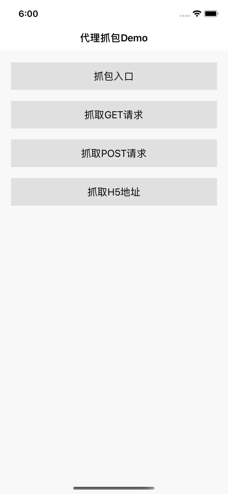
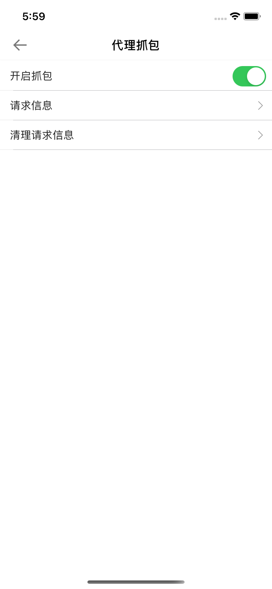
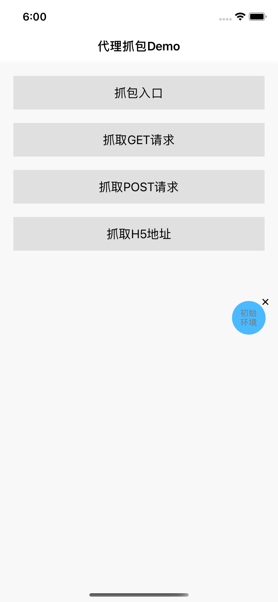
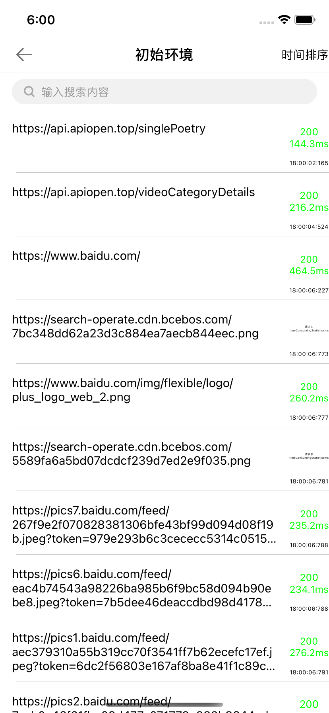
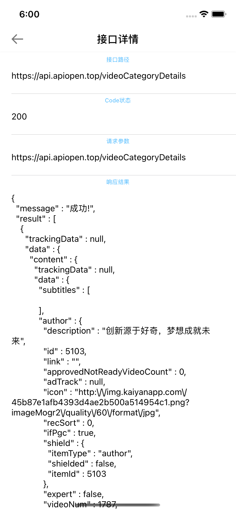

# iOS 应用内抓包

### 1、背景

平时开发及使用经常会遇到需要抓接口的情形，以往的抓包场景有两种：

- 第一种是手机端连接电脑，电脑打开抓包工具，进行内部接口抓取，但此种方式需要设备、工具齐全，https请求还需要安装信任
  证书，若身边没有电脑就无法操作；
- 第二种是手机端安装抓包工具进行接口抓取，但抓包工具往往收费的比较多，使用免费或破解版又会担心数据安全问题。

为了使任何安装了APP设备在出现任何接口异常或者接口数据需要考证的时候，能及时抓取接口验证，因此就孕育而生应用内抓包的功能
模块的研究及开发。

### 2、设计思路

* 需要有一个可控制是否抓包的开关
* 接口请求列表，最好在列表上可以简单了解到一些信息，例如接口地址、请求状态（成功与否）、请求用时等
* 接口请求详情，接口请求具体信息，包含请求地址、状态、参数、结果、错误信息
* 搜索功能，可搜索特定的一批或一个接口
* 排序功能，按请求时间正序或者倒序
* 考虑到内存问题，默认缓存特定数量的接口请求，并且可以手动清除所有请求
* 有个悬浮在窗口层的悬浮按钮，方便进入工具的展示及操作列表

### 3、设计实现

核心实现就是依赖于NSURLProtocol，可以通过它对上层的URLRequest请求做拦截，并根据自己的需求场景做定制化响应处理。基本流程就是实现一个继承于NSURLProtocol的类，通过父类方法拦截到原请求，重新发一个原请求的拷贝，在请求回调里面记录及处理请求信息，并通过client属性将结果数据等抛给原请求的上层。
核心代码如下：

继承于NSURLProtocol的类里的处理

	+(BOOL)canInitWithRequest:(NSURLRequest *)request {
		if ([scheme caseInsensitiveCompare:@"http"] == NSOrderedSame || [scheme caseInsensitiveCompare:@"https"] == NSOrderedSame) {
	    // 看看是否已经处理过了，防止无限循环
	  		if ([NSURLProtocol propertyForKey:DLCustomURLProtocolHandledKey inRequest:request]) {
	       	 return NO;
	    	}
	  	}
		return YES;
	}
	
	+(NSURLRequest *)canonicalRequestForRequest:(NSURLRequest *)request{
		NSMutableURLRequest *ipRequest = [request mutableCopy];
		return ipRequest;
	}
	
	- (void)startLoading{
		self.startTime = [[NSDate date] timeIntervalSince1970] * 1000;
		NSMutableURLRequest *mutableRequest = [[self request] mutableCopy];
		self.mutableRequest = mutableRequest;
		[NSURLProtocol setProperty:@YES forKey:DLCustomURLProtocolHandledKey inRequest:mutableRequest];
		NSURLSessionConfiguration *sessionConfig = [NSURLSessionConfiguration defaultSessionConfiguration];
		self.session = [NSURLSession sessionWithConfiguration:sessionConfig delegate:self delegateQueue:nil];
		NSURLSessionDataTask *dataTask = [self.session dataTaskWithRequest:mutableRequest];
		//处理请求
		[dataTask resume];
	}
	
	- (void)stopLoading{
		// 这部分为需要统计时间的代码
		double end = [[NSDate date] timeIntervalSince1970] * 1000;
		//处理请求
		[self.session invalidateAndCancel];
		self.session = nil;
	}

再实现请求协议，协议方法里操作client属性
	

	- (void)URLSession:(NSURLSession *)session dataTask:(NSURLSessionDataTask *)dataTask didReceiveResponse:(NSURLResponse *)response completionHandler:(void (^)(NSURLSessionResponseDisposition))completionHandler {
		...
		[self.client URLProtocol:self didReceiveResponse:response cacheStoragePolicy:NSURLCacheStorageNotAllowed];
		completionHandler(NSURLSessionResponseAllow);
	}	
	
	- (void)URLSession:(NSURLSession *)session dataTask:(NSURLSessionDataTask *)dataTask didReceiveData:(NSData *)data {
		...
		[self.client URLProtocol:self didLoadData:data];
	}
	
	- (void)URLSession:(NSURLSession *)session task:(NSURLSessionTask *)task didCompleteWithError:(NSError *)error{
	 if (error) {
	..
	    [self.client URLProtocol:self didFailWithError:error];
	}else{
	...        
	    [self.client URLProtocolDidFinishLoading:self];
	}

###    4、Demo介绍

打开开关

接口列表

接口详情

### 5、集成步骤

	1、导入库
	
	2、- application:didFinishLaunchingWithOptions:方法里设置
	[CharlesTool isTurnOnDefaultDebugging:NO];
	
	3、进入代理抓包页 
	[[CharlesTool debugSetViewControllerController];
